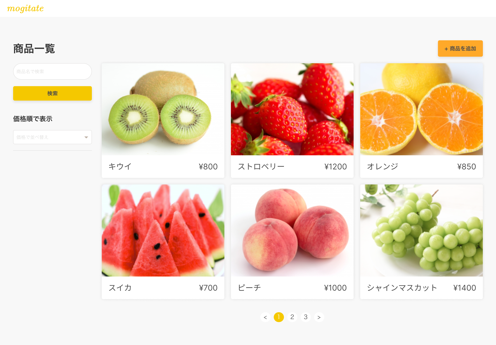
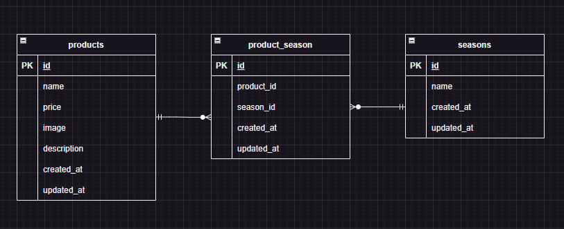

# サービス名 【 mogitate 】

【　機能一覧　】

/products                       商品一覧ページ

/products/{productId}	        商品詳細ページ

/products/{productId}/update    商品更新ページ

/products/register	            商品登録ページ

/products/search                検索ページ

/products/{productId}/delete	削除ページ

【　環境構築　】

リポジトリをクローン

git clone git@github.com:kohsai/mogitate.git

Docker起動

DockerDesktopアプリを立ち上げる

docker-compose up -d --build

【 MySQLデータベースと権限の設定 】

DockerコンテナでMySQLデータベースが自動作成されるよう設定済みです。

作成される内容：

データベース名: laravel_db

ユーザー名: laravel_user

パスワード: laravel_pass

必要な設定は docker-compose.yml に記述済みです。

【　Laravel環境構築　】

docker-compose exec php bash

composer install

【 .env ファイルを作成 】

プロジェクトをクローンした場合、.env ファイルが存在しないため、次の手順で作成します。

.env.example ファイルを .env ファイルとしてコピーします。

cp .env.example .env

.env ファイルを編集し、以下の内容を確認または修正してください。

.envに以下の環境変数を設定します。

DB_CONNECTION=mysql

DB_HOST=mysql

DB_PORT=3306

DB_DATABASE=laravel_db

DB_USERNAME=laravel_user

DB_PASSWORD=laravel_pass

【　アプリケーションキーの作成　】

php artisan key:generate

【　マイグレーションの実行　】

php artisan migrate

【　初期データの登録（シードの実行）　】

php artisan migrate --seed

注意:
シードの実行により、初期データがデータベースに挿入されます。この操作は必須です。

【　使用技術（実行環境）】

・PHP: 7.4.9

・Laravel Framework: 8.83.29

・MySQL: 8.0.26

【　ER図　】

【　開発用アクセスURL 】

・Laravelアプリ：http://localhost/products
（※ php artisan serve は不要です。Apache経由で動作します）

・phpMyAdmin：http://localhost:8080
